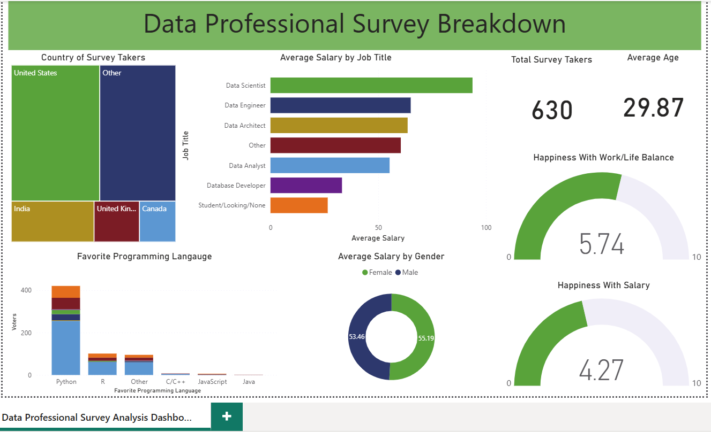

# Data Professional Survey Analysis Dashboard (Power BI)

## 📌 Overview

This project presents an interactive Power BI dashboard analyzing survey data from data professionals across different countries, roles, and demographics.

The dashboard provides insights into salary trends, job satisfaction, work-life balance, favorite programming languages, and career-related patterns using real-world survey data.

---

## 🎯 Objectives

* Analyze salary trends across different data roles
* Understand work-life balance and salary satisfaction
* Explore demographic insights among survey participants
* Identify popular programming language preferences

---

## 🛠️ Tools Used

* Power BI
* DAX
* Data Visualization
* Data Modeling

---

## 📊 Dashboard Features

* Average Salary by Job Title
* Programming Language Preferences
* Country-wise Survey Participation
* Work-Life Balance & Salary Satisfaction Metrics
* Demographic Analysis

---

## 🔗 Live Dashboard

👉 [View Power BI Dashboard Here](https://app.powerbi.com/links/Wj0y4hrdzg?ctid=3e4b9d6c-8566-41ad-ac1d-eafe1108951e&pbi_source=linkShare)

---

## 📸 Dashboard Preview

---

## 🚀 Key Insights

* Data Scientists reported the highest average salaries among surveyed roles
* Python emerged as the most preferred programming language
* Work-life balance satisfaction was higher than salary satisfaction overall
* Survey responses were dominated by professionals from the United States and India

---

## 📁 Project Files

* `Data_Professional_Survey_Analysis.pbix`
* Dashboard screenshot
* README documentation

---

## 📬 Contact

* LinkedIn: www.linkedin.com/in/muhammedshifin

---
